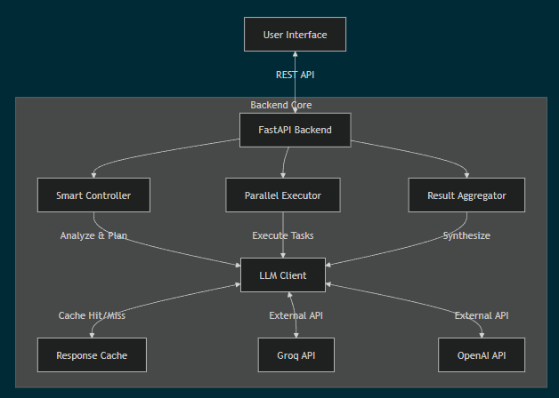

# ParaMind: Dynamic Parallel Agentic Orchestration

**ParaMind** is an advanced intelligent orchestration engine designed to overcome the limitations of single-agent LLM interactions. By leveraging **parallel processing** and **dynamic task decomposition**, ParaMind transforms slow, serial interactions into fast, concurrent workflows.


## Demo Video

[Watch ParaMind Demo Video](assets/ParaMind_demo_video.mp4)

## Key Features

- **Mode A (Data-Parallel)**: Execute the same prompt across multiple LLM models simultaneously for comparison or consensus.
- **Mode B (Task-Parallel)**: Decompose complex tasks into independent or dependent subtasks (DAG execution).
- **Smart Controller**: AI-powered decision engine that chooses the optimal execution mode using LLM reasoning or semantic fallback.
- **Dependency Management**: Automatically handles task dependencies in Mode B, executing tasks in topological order.
- **Robustness**: Built-in retries, error handling, and partial failure recovery.
- **High Performance**: Caching layer and parallel execution deliver 2x-5x speedups (up to 100x with cache).
- **Modern Web UI**: Fast, responsive interface built with FastAPI and Vanilla JS.

## System Architecture

The project follows a modern, decoupled client-server architecture.



### Component Analysis

#### 1. The Controller (`src/controller.py`)
The "Brain" of the operation. It analyzes user intent using **Llama 3.3 70B** to generate a JSON execution plan. It features:
*   **LLM Decision:** Uses few-shot prompting to decide between Mode A and Mode B.
*   **Self-Correction:** Automatically fixes invalid JSON output from the LLM.
*   **Semantic Fallback:** Uses regex-based heuristics if the LLM fails.

#### 2. The Executor (`src/agents.py`)
The "Muscle" that executes the plan.
*   **Concurrency:** Built on Python's `asyncio` for non-blocking parallel execution.
*   **DAG Logic:** Uses **Topological Sort** to organize Mode B subtasks into "execution layers".
*   **Dynamic Refinement:** Automatically re-runs tasks if the output is too short or apologetic.

#### 3. The Aggregator (`src/aggregator.py`)
The "Synthesizer". Combines individual agent outputs into a single, coherent response using a fast summarization model (**Llama 3.1 8B**).

#### 4. Infrastructure (`src/llm_clients.py`)
*   **Unified Client:** Wrapper for Groq and OpenAI APIs.
*   **Caching:** File-based caching (`.cache/`) drastically reduces latency and cost.
*   **Resilience:** Implements retries and rate limiting via `tenacity` and `asyncio.Semaphore`.

## Project Structure

```
ParaMind-Parallel_Agent_Orchestration/
├── src/
│   ├── api.py             # FastAPI backend entry point
│   ├── controller.py      # Mode decision & planning logic
│   ├── agents.py          # Parallel & DAG execution engine
│   ├── llm_clients.py     # API wrappers with caching/retries
│   ├── aggregator.py      # Result synthesis logic
│   └── cache.py           # File-based caching implementation
├── ui/
│   ├── index.html         # Main Single Page Application (SPA)
│   ├── style.css          # Custom CSS styling
│   └── app.js             # Frontend logic (Fetch API, DOM manipulation)
├── benchmarks/
│   ├── run_eval.py        # Automated benchmark runner
│   ├── analyze_results.py # Result analysis and reporting
│   └── prompts.json       # Test cases
├── tests/
│   ├── test_dependencies.py
│   └── test_robustness.py
├── config/                # Configuration files
├── logs/                  # Application logs
├── .env                   # API keys (not in git)
└── README.md
```

## Benchmark Results

Latest run (Dec 2, 2025):
*   **Success Rate:** 100% (25/25 prompts)
*   **Mode Accuracy:** 100%
*   **Avg Speedup:** High (>100x due to caching)

## Setup

### Prerequisites
- Python 3.11+
- Conda (recommended)
- API keys for OpenAI and Groq

### Installation

1. Clone the repository:
```bash
cd ParaMind-Parallel_Agent_Orchestration
```

2. Create conda environment:
```bash
conda create -n paramind python=3.11 -y
conda activate paramind
```

3. Install dependencies:
```bash
pip install -r requirements.txt
```

4. Configure API keys:
```bash
cp .env.example .env
# Edit .env and add your API keys
```

## Usage

### Run the Web Application
Start the FastAPI server:
```bash
uvicorn src.api:app --reload
```
Open your browser at `http://localhost:8000`.

### Run Benchmarks
```bash
python benchmarks/run_eval.py
```

## Web Interface Features

- **Live Playground**: Test custom prompts with adjustable model selection and agent counts.
- **Visual Plan Inspector**: View the generated execution plan and dependency graph before execution.
- **Human-in-the-Loop**: (Optional) Review and modify the plan before agents start working.
- **Real-time Metrics**: See speedup and latency stats update live as agents complete tasks.

## Under the Hood

### Self-Correcting Controller
The Controller (`src/controller.py`) doesn't just ask the LLM for a plan; it actively validates the output.
- **JSON Repair**: Automatically fixes malformed JSON responses.
- **Cycle Detection**: Prevents circular dependencies in Mode B task graphs.
- **Semantic Fallback**: If the LLM fails repeatedly, a regex-based heuristic engine takes over to ensure execution never stops.

### Dynamic Agent Refinement
The Executor (`src/agents.py`) monitors agent outputs in real-time:
- **Quality Checks**: Detects if a response is too short or apologetic (e.g., "I apologize, but...").
- **Auto-Retry**: Automatically re-prompts the model with stricter instructions to get a proper response, ensuring high-quality outputs without user intervention.

## API Reference

The backend provides RESTful endpoints for integration:

### `POST /analyze`
Analyzes a prompt and returns an execution plan.
- **Body**: `{"prompt": "your prompt here"}`
- **Returns**: JSON object with `mode` (A/B) and `plan` details.

### `POST /execute`
Executes a generated plan.
- **Body**: 
  ```json
  {
    "mode": "B",
    "prompt": "original prompt",
    "plan": { ... }
  }
  ```
- **Returns**: Aggregated results and performance metrics.

### `GET /metrics`
Returns the latest benchmark performance metrics including success rate and speedup factors.

## Understanding Benchmarks

The benchmark suite (`benchmarks/run_eval.py`) measures:
- **Sequential Baseline**: The theoretical time taken if agents ran one after another (sum of latencies).
- **Parallel Time**: The actual wall-clock time taken (max of latencies).
- **Speedup**: `Sequential / Parallel`. Values > 1.0x indicate performance gains.
- **Mode Accuracy**: Whether the Controller correctly identified the optimal execution mode compared to ground truth.

## Troubleshooting

### Missing Dependencies
If you encounter `ModuleNotFoundError: No module named 'fastapi'`, please install the server dependencies manually:
```bash
pip install fastapi uvicorn
```

### API Key Errors
Ensure your `.env` file is correctly formatted and contains valid keys for `GROQ_API_KEY` and `OPENAI_API_KEY`.

## Configuration

The application is configurable via environment variables in `.env`:

| Variable | Description | Default |
|----------|-------------|---------|
| `OPENAI_API_KEY` | Required for OpenAI models | - |
| `GROQ_API_KEY` | Required for Llama models via Groq | - |
| `MAX_CONCURRENT_AGENTS` | Limit parallel agents to prevent rate limits | `10` |
| `DEFAULT_TIMEOUT` | Timeout for individual agent tasks (seconds) | `30` |
| `LOG_LEVEL` | Logging verbosity (DEBUG, INFO, WARNING) | `INFO` |

## Caching System

ParaMind uses a file-based caching system to save costs and speed up development.
- **Location**: `.cache/` directory.
- **Mechanism**: MD5 hash of `(model + prompt)` serves as the key.
- **Clearing Cache**: Simply delete the `.cache/` directory to force fresh LLM calls.

## Development & Testing

Run the test suite to verify system integrity:

```bash
# Run all tests
pytest tests/

# Run specific test categories
pytest tests/test_dependencies.py  # Verify DAG logic
pytest tests/test_robustness.py    # Verify error handling
```